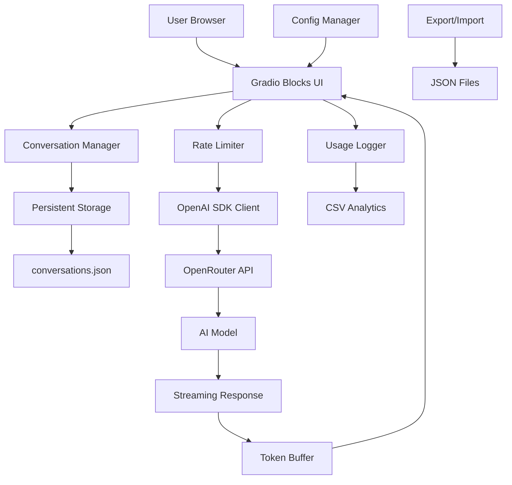
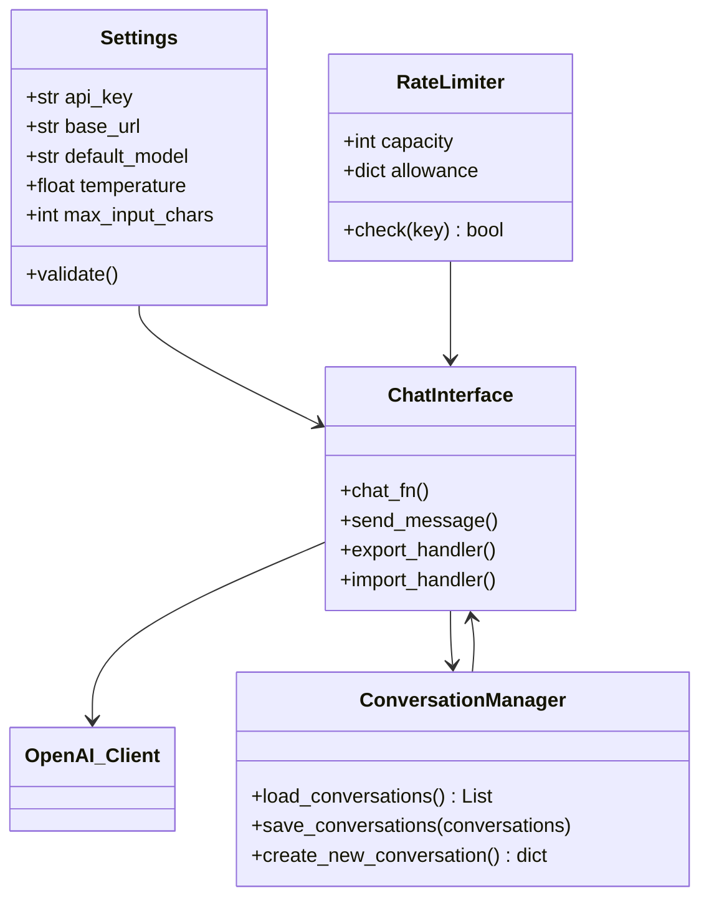

# OpenRouter × Gradio Chat Interface

A production-ready streaming conversational AI interface built with Gradio v5 and OpenRouter's API ecosystem.

[](https://opensource.org/licenses/MIT)

## Quick Reference

**Key Features:**
- **Token-streaming responses** via Gradio v5 Blocks interface [[EVID: main.py:92-156 | chat_fn generator with yield statements]]
- **Dynamic model catalog** from OpenRouter's `/api/v1/models` endpoint [[EVID: main.py:28-65 | fetch_models function]]
- **Per-IP rate limiting** with token bucket algorithm [[EVID: utils.py:23-41 | RateLimiter class implementation]]
- **Conversation management** with persistent storage in conversations.json [[EVID: main.py:177-201 | load_conversations and save_conversations functions]]
- **Sidebar UI** for conversation navigation, creation, and deletion [[EVID: main.py:210-220 | sidebar UI components]]
- **Automatic conversation saving** across sessions [[EVID: main.py:193-195 | save_conversations function]]
- **Usage analytics** logged to CSV with latency tracking [[EVID: utils.py:48-55 | log_usage function]]
- **Configurable system prompts** and temperature controls [[EVID: main.py:226-228 | UI controls setup]]
- **Production deployment** support with Docker [[EVID: Dockerfile:1-21 | Docker configuration]]

**Tech Stack:**
- [Gradio](https://gradio.app/) v5+ (Blocks with sidebar)
- [OpenAI Python SDK](https://github.com/openai/openai-python) v1.40+ (OpenRouter-compatible)
- [OpenRouter](https://openrouter.ai/) API
- [structlog](https://www.structlog.org/en/stable/) 24.1 for structured logging with context propagation [[EVID: config.py:15-89 | structlog configuration]]
- Python 3.12 with asyncio support

## Architecture Overview



The application uses Gradio Blocks for a responsive UI with sidebar conversation management. User messages flow through conversation persistence, rate limiting, and OpenRouter's API, with responses streamed back token-by-token. Conversations are automatically saved to conversations.json for persistence across sessions.



Core components interact through dependency injection, with Settings providing configuration, RateLimiter controlling access, ConversationManager handling persistent storage, and ChatInterface orchestrating the conversation flow with sidebar UI.

## Installation

**Prerequisites:**
- Python 3.12 [[EVID: Dockerfile:1 | Python version requirement]]
- OpenRouter API key from [openrouter.ai](https://openrouter.ai/)

**Setup:**

```bash
# Clone and navigate to project
git clone <repository-url>
cd openrouter-gradio-chat

# Create virtual environment
python -m venv .venv
source .venv/bin/activate  # Linux/macOS
# .venv\Scripts\Activate.ps1  # Windows PowerShell

# Install dependencies
pip install -r requirements.txt

# Configure environment
cp .env.example .env
# Edit .env and set OPENROUTER_API_KEY=your_key_here

# Install Git hooks (optional but recommended)
pre-commit install
```

Installing the Git hooks ensures the configured formatters, linters, and type
checkers run automatically before each commit. Re-run `pre-commit install`
after cloning the repository or whenever the `.pre-commit-config.yaml` file is
updated to keep the hooks in sync with the project configuration.

**Verification:**

```bash
python main.py
# Should start server on http://127.0.0.1:7860
```

## Usage

### Quickstart Tutorial

1. **Start the application:**
   ```bash
   python main.py
   ```

2. **Access the interface** at `http://localhost:7860` [[EVID: config.py:35 | default port setting]]

3. **Configure your session:**
   - Select model from dropdown (defaults to `openai/gpt-4o`) [[EVID: config.py:25 | default_model setting]]
   - Adjust temperature slider (0.0-1.2, default 0.3) [[EVID: config.py:28 | temperature setting]]
   - Modify system prompt if needed

4. **Start chatting** - responses stream in real-time

### Conversation Management

1. **Create new conversations** using the "New" button in the sidebar
2. **Switch between conversations** using the dropdown selector
3. **Delete conversations** with the "Delete" button (current conversation is preserved)
4. **Export conversations** as JSON files for backup or sharing
5. **Import conversations** by uploading JSON files from previous exports

Conversations are automatically saved to `conversations.json` and persist across application restarts.

### Configuration

| Environment Variable | Default | Description |
|---------------------|---------|-------------|
| `OPENROUTER_API_KEY` | *required* | Your OpenRouter API key [[EVID: config.py:18 | api_key validation]] |
| `DEFAULT_MODEL` | `openai/gpt-4o` | Initial model selection [[EVID: config.py:20 | default_model]] |
| `TEMPERATURE` | `0.3` | Response creativity (0.0-2.0) [[EVID: config.py:23 | temperature bounds]] |
| `MAX_INPUT_CHARS` | `8000` | Maximum input characters per message [[EVID: config.py:26 | max_input_chars]] |
| `MAX_HISTORY_MESSAGES` | `40` | Maximum messages to keep in history [[EVID: config.py:27 | max_history_messages]] |
| `RATE_LIMIT_REQUESTS_PER_MIN` | `60` | Per-IP rate limit [[EVID: config.py:30 | rate_limit_per_min]] |
| `ENABLE_ANALYTICS` | `true` | Enable usage logging to CSV [[EVID: config.py:33 | enable_analytics]] |
| `HOST` | `0.0.0.0` | Server bind address [[EVID: config.py:36 | host setting]] |
| `PORT` | `7860` | Server port [[EVID: config.py:37 | port setting]] |
| `TRUSTED_PROXIES` | *(empty)* | Comma-separated list of trusted proxy IPs [[EVID: config.py:40-44 | trusted_proxies]] |
| `LOG_LEVEL` | `INFO` | Root log level for both stdlib and structlog [[EVID: config.py:50-85 | log level wiring]] |
| `LOG_JSON` | `true` | Enable JSON-formatted logs (set to `false` for console renderer) [[EVID: config.py:50-85 | renderer selection]] |
| `LOG_PATH` | `logs/app.log` | File path for rotating log handler [[EVID: config.py:55-85 | file handler configuration]] |
| `LOG_ROTATION_WHEN` | `midnight` | Rotation frequency schedule for log file [[EVID: config.py:56-85 | TimedRotatingFileHandler setup]] |
| `LOG_ROTATION_INTERVAL` | `1` | Rotation interval multiplier (bounded 1-1440) [[EVID: config.py:56-85 | interval parsing]] |
| `LOG_BACKUP_COUNT` | `7` | Number of rotated log files retained [[EVID: config.py:56-85 | backup retention]] |

### API Examples

**Export conversation:**
```python
# Click "Export" button in sidebar
# Downloads current conversation to .data/chat_<timestamp>.json
# Useful for backup or sharing specific conversations
```

**Import conversation:**
```python
# Upload JSON file via file selector in sidebar
# Creates new conversation from exported JSON
# Supports full chat history restoration
```

## Project Structure

```
├── main.py              # Gradio Blocks application with sidebar UI
├── config.py            # Environment-based configuration
├── utils.py             # Rate limiting, sanitization, logging
├── requirements.txt     # Python dependencies
├── .env.example         # Environment template
├── conversations.json   # Persistent conversation storage
├── README.md           # Documentation
└── .data/              # Generated logs and exports
    ├── usage.csv       # Analytics data with latency tracking
    └── chat_*.json     # Exported conversation backups
```

## Development Guide

### Local Development

```bash
# Install development dependencies
pip install -r requirements.txt

# Run with debug info
python main.py
# App reloads automatically with Gradio's dev mode
```

### Testing

```bash
# Run basic functionality test
python -c "from config import settings; print('Config OK')"
python -c "from utils import RateLimiter; print('Utils OK')"

# Test rate limiter
python -c "
from utils import RateLimiter
rl = RateLimiter(60)
print('Rate limit check:', rl.check('test-ip'))
"
```

### Code Style

- Follow PEP 8 conventions
- Use type hints with `from __future__ import annotations` [[EVID: config.py:1 | future annotations import]]
- Dataclasses for configuration [[EVID: config.py:8 | @dataclass decorator]]
- Context managers for thread safety [[EVID: utils.py:30 | with self.lock]]

## Additional Documentation

- **Deployment:** Use the provided Dockerfile for containerized deployment
- **API Reference:** OpenRouter docs at [openrouter.ai/docs](https://openrouter.ai/docs)
- **License:** MIT License

## Troubleshooting

**"No models in dropdown"**
- OpenRouter `/models` endpoint may be unavailable
- App falls back to curated model list [[EVID: main.py:40-50 | fallback models in fetch_models]]

**"Rate limit exceeded"**
- Adjust `RATE_LIMIT_REQUESTS_PER_MIN` in `.env` [[EVID: config.py:32 | rate limit setting]]
- Rate limiter uses per-IP token bucket [[EVID: utils.py:25-35 | RateLimiter.check method]]

**Streaming responses stall**
- Check network timeouts in OpenAI client configuration [[EVID: main.py:15 | httpx.Timeout configuration]]

---